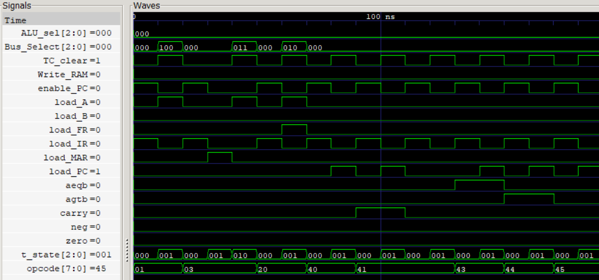

# Control Unit (CU)

A combinational Hardwired Control Unit responsible for generating the processor's 15-bit control word. The Control Unit decodes the current instruction opcode together with the processor T-State and status flags to generate all control signals required for instruction fetch, data transfer, arithmetic execution, memory access, and conditional branching.

Unlike a microprogrammed controller, all control signals are generated directly using combinational logic, providing deterministic instruction execution with low hardware complexity and latency.

## Features

* Hardwired combinational control logic
* 16-bit control word generation
* Opcode-based instruction decoding
* T-State based instruction sequencing
* Conditional branch evaluation using processor flags
* Parameterized T-State width

<p align="center">
  
  <br>
  <sub>Control Unit producing control words for corresponding Opcode and T-State</sub>
</p>

## Synthesis Results

**Technology:** Sky130 HD

**Synthesis Tool:** Yosys

| Metric         |            Value |
| -------------- | ---------------: |
| Area           | **359.0944 µm²** |

## Static Timing Analysis (OpenSTA)

### Scenario 1: Ideal Timing

No input/output timing constraints applied.

| Metric                  |        Value |
| ----------------------- | -----------: |
| Estimated Critical Path |  **1.29 ns** |
| Estimated Fmax          | **~775 MHz** |

### Scenario 2: Constrained Timing

Timing constraints:
```
Input Delay = 1 ns
Output Delay = 1 ns
```
| Metric                  |        Value |
| ----------------------- | -----------: |
| Estimated Critical Path |  **2.29 ns** |
| Estimated Fmax          | **~437 MHz** |

## Timing Comparison

| Scenario        | Estimated Critical Path | Estimated Fmax |
| --------------- | ----------------------: | -------------: |
| Ideal STA       |             **1.29 ns** |   **~775 MHz** |
| Constrained STA |             **2.29 ns** |   **~437 MHz** |

## Power Analysis

| Metric      |       Value |
| ----------- | ----------: |
| Total Power | **41.4 µW** |
