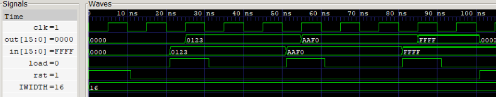

# Instruction Register (IR)

A Parameterized 16-bit loadable Instruction Register with asynchronous reset. The Instruction Register stores the current instruction fetched from the Instruction Memory (ROM) and presents it to the Control Unit for decoding and execution.

## Features

- Parameterized instruction width
- Asynchronous active-high reset
- Synchronous instruction loading
- Holds current instruction when load = 0
- Serves as the interface between Instruction Memory and the Control Unit

<p align="center">
  
  <br>
  <sub>Instruction Register</sub>
</p>

## Synthesis Results

**Technology:** Sky130 HD  
**Synthesis Tool:** Yosys

| Metric | Value |
|--------|-------:|
| Area | 640.6144 µm² |

## Static Timing Analysis (OpenSTA)

### Scenario 1: Ideal Timing

Clock period constraint:

```
10 ns
```

No input/output timing constraints applied.

| Metric | Value |
|--------|-------:|
| Clock Period | 10 ns |
| Worst Slack | 9.28 ns |
| Estimated Critical Path | 0.72 ns |
| Estimated Fmax | ~1.39 GHz |

### Scenario 2: Constrained Timing

Timing constraints:
```
Input Delay = 1 ns
Output Delay = 1 ns
Clock Period = 10 ns
```
| Metric | Value |
|--------|-------:|
| Clock Period | 10 ns |
| Worst Slack | 8.59 ns |
| Estimated Critical Path | 1.41 ns |
| Estimated Fmax | ~709 MHz |

## Timing Comparison

| Scenario | Worst Slack (ns) | Estimated Fmax |
|----------|-----------------:|---------------:|
| Ideal STA | 9.28 | ~1.39 GHz |
| Constrained STA | 8.59 | ~709 MHz |

## Power Analysis

Operating Frequency: **100 MHz** (10 ns clock period)

| Metric | Value |
|--------|-------:|
| Total Power | 79.7 µW |
