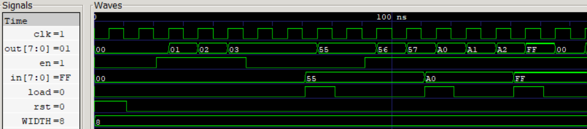

# Program Counter (PC)
An 8-bit parameterized loadable counter with asynchronous reset used to track instruction addresses during program execution.

### Features
* Positive-edge triggered operation
* Asynchronous reset
* Automatic address incrementation
* Supports loading arbitrary addresses for jump operations
* Natural wrap-around at maximum address value (0xFF → 0x00)
* Parameterized width for scalability

<p align="center">
  
  <br>
  <sub>Program Counter incrementing and loading new values on load</sub>
</p>

### Functional Behavior

| Condition | Operation   |
| --------- | ----------- |
| rst = 1   | PC ← 0      |
| load = 1  | PC ← in     |
| Otherwise | PC ← PC + 1 |

## Synthesis Results

**Technology:** Sky130 HD
**Synthesis Tool:** Yosys

| Metric     | Value        |
| ---------- | ------------ |
| Area       | 391.6256 µm² |

## Static Timing Analysis (OpenSTA)

### Scenario 1: Ideal Timing

Clock period constraint:

```text
10 ns
```

No input/output timing constraints applied.

| Metric            | Value       |
| ----------------- | ----------- |
| Clock Period      | 10 ns       |
| Worst Slack       | 8.83 ns     |
| Data Arrival Time | 1.08 ns     |
| Setup Time        | 0.08 ns     |
| Estimated Fmax    | ~862.06 MHz |

### Scenario 2: Constrained Timing

Timing constraints:

```text
Input Delay  = 1 ns
Output Delay = 1 ns
Clock Period = 10 ns
```

| Metric            | Value       |
| ----------------- | ----------- |
| Clock Period      | 10 ns       |
| Worst Slack       | 8.64 ns     |
| Data Arrival Time | 1.27 ns     |
| Setup Time        | 0.08 ns     |
| Estimated Fmax    | ~735.29 MHz |

## Timing Comparison

| Scenario        | Worst Slack (ns) | Estimated Fmax |
| --------------- | ---------------- | -------------- |
| Ideal STA       | 8.83             | ~862.06 MHz    |
| Constrained STA | 8.64             | ~735.29 MHz    |

## Power Analysis

**Operating Frequency:** 100 MHz (10 ns clock period)

| Metric          | Value    |
| --------------- | -------- |
| Total Power     | 44.2 µW  |
| Internal Power  | 39.6 µW  |
| Switching Power | 4.62 µW  |
| Leakage Power   | 0.167 nW |

Approximately 87.5% of total power consumption originates from sequential logic (flip-flops), with the remaining 12.5% consumed by combinational increment and control logic.

## Verification

The Program Counter was verified using RTL simulation and Gate-Level Simulation (GLS).
RTL and GLS outputs matched, confirming functional equivalence between the behavioral description and the synthesized Sky130 gate-level implementation.
