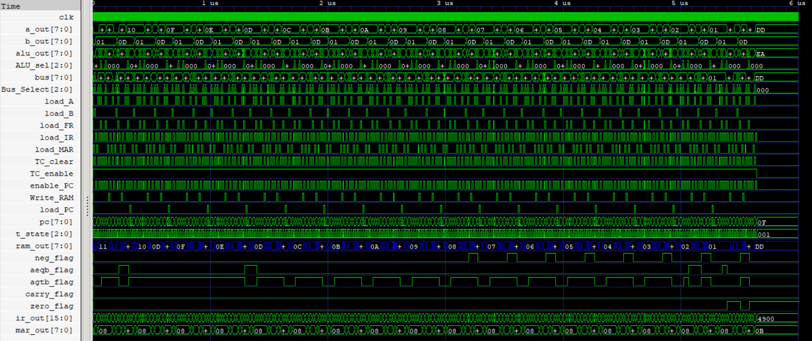

# 8Bit-Computer-rtl
A parameterized 8-bit stored-program computer designed from the RTL level in Verilog. The processor follows a **Harvard architecture** with separate program and data memories, a custom Instruction Set Architecture (ISA), a **hardwired control unit**, and a **multiplexer-based internal data bus** for datapath communication.

## 🛠️ Tools & Technologies


## 🧩 System Organization
<p align="center">
  
</p>

## 📚 Documentation
- [Instruction Set Architecture](ISA.md)
- [Computer Organization](Organization.md)

## ⚖️ Maximum of Two Numbers

This program compares two unsigned 8-bit values stored in RAM address `0x08` and `0x09` and writes the larger value back to RAM address `0x0A`. It demonstrates arithmetic, conditional branching, memory operations, and program control using the processor's custom instruction set.

`Max.asm`

```asm
; Program: Maximum of Two Numbers

        LDA 0x08        ; Load first number
        LDB 0x09        ; Load second number

        SUB             ; Compute A - B
        JN  STORE_B     ; If A < B, branch to store second number

        LDA 0x08        ; Restore first number
        STA 0x0A        ; Store first number as maximum
        JMP END         ; Skip alternate path

STORE_B:
        STB 0x0A        ; Store second number as maximum

END:
        HLT             ; End program
```

**Program Source:** [Max.hex](Computer/Programs/Max.hex)

Demonstrates data movement (`LDA, LDB, STA, STB`), ALU computation (`SUB`), flag-based control flow (`JN`), program control (`JMP`), and processor termination (`HLT`).

> The waveform captures the branch-taken execution path, where the processor skips the alternate instruction sequence after evaluating the Negative flag, demonstrating conditional control flow.

`[Max[0x17(23), 0x3A(58)] = 0x3A(58)]`
<p align="center">
  
  <br>
  <sub>RTL simulation of the processor executing the Maximum of Two Numbers program, illustrating instruction fetch, ALU computation, memory operations, and control flow .</sub>
</p>

## ✖️ Integer Multiplication

This program multiplies two unsigned 8-bit values using repeated addition. The multiplicand is stored in RAM address `0x07` and the multiplier stored in RAM address `0x08` acts as the loop counter. A constant value of 1 is stored inRAM address `0x06` for decrementing the counter, and the accumulated product is written to RAM address `0x09`.

`Mult.asm`

```asm
; Unsigned Integer Multiplication (Repeated Addition)

LOOP:
    LDB 0x06          ; Load constant 1
    LDA 0x08          ; Load multiplier (loop counter)

    PASS A            ; Check if counter is zero
    JZ  DONE          ; Finish if multiplication is complete

    SUB               ; Decrement counter
    STA 0x08          ; Store updated counter

    LDA 0x09          ; Load accumulated result
    LDB 0x07          ; Load multiplicand
    ADD               ; Add multiplicand to result
    STA 0x09          ; Store updated result

    LDA 0x08          ; Reload counter
    PASS A            ; Update status flags
    JNZ LOOP          ; Repeat until counter becomes zero

DONE:
    LDA 0x09          ; Load final product
    HLT               ; End program
```
**Program Source:** [Mult.hex](Computer/Programs/Mult.hex)

> Replacing LDB 0x06 with LOAD B, 0x01 removes one memory access per loop iteration, saving one clock cycle per iteration. Consequently, the optimization scales linearly with the multiplier value, reducing execution time by up to 255 clock cycles (2550 ns at a 10 ns clock period) for an 8-bit multiplier.

Demonstrates Memory operations (`LDA`, `LDB`, `STA`), arithmetic (`ADD`, `SUB`, `PASS A`), status flag evaluation (`JZ`, `JNZ`), iterative control flow, looping, and program termination (`HLT`).

> The waveform below shows the execution of the Integer Multiplication program implemented using repeated addition. The processor repeatedly executes the fetch-decode-execute cycle, decrementing the multiplier while accumulating the multiplicand. The compressed timeline highlights multiple loop iterations, repeated memory accesses, arithmetic operations, conditional branching, and the final program termination (HLT).

`[0x11(17) x 0x0D(13) = 0xDD(221)]`
<p align="center">
  
  <br>
  <sub>RTL simulation of the processor executing the Multiplication program, illustrating iterative execution until final product is produced.</sub>
</p>

> The example programs demonstrate that algorithms such as Maximum of Two Numbers and Integer Multiplication are implemented entirely in software using the custom ISA rather than dedicated hardware instructions. By combining arithmetic, memory operations, conditional branching, and loops, the processor supports general-purpose algorithmic execution.

## 🔢 2×2 Unsigned Matrix Multiplication

This program implements unsigned 2×2 matrix multiplication entirely in software using the custom ISA. The input matrices are stored in RAM locations `0x00–0x03` and `0x04–0x07`, while the resulting matrix is written to `0x10–0x13`. Since the processor provides no dedicated hardware multiply instruction, each multiplication is implemented through repeated addition, with conditional branches and loops controlling program execution.

```asm
; Algorithm
multiply(x, y):
    result = 0
    while x > 0:
        result += y
        x -= 1
    return result

C00 = multiply(A, E) + multiply(B, G)
C01 = multiply(A, F) + multiply(B, H)
C10 = multiply(C, E) + multiply(D, G)
C11 = multiply(C, F) + multiply(D, H)
```
**Program Source:** [Matmul.hex](Computer/Programs/Matmul.hex)

The program was verified in simulation by observing the processor compute each matrix element through repeated-addition multiplication and accumulation. At program completion, the output matrix stored in RAM exactly matches the expected result.

<p align="center">
  
</p>

<p align="center">
<sub>Waveform showing execution of the software-based 2×2 matrix multiplication program. The final values loaded into the A and B registers correspond to the computed output matrix stored at RAM locations <code>0x10</code>-<code>0x13</code>.</sub>
</p>

```
A = [07(0x00) 09(0x01)]   B = [02(0x04) 03(0x05)]   A × B = [3B(0x10) 54(0x11)]
    [0B(0x02) 0D(0x03)]       [05(0x06) 07(0x07)]           [57(0x12) 7C(0x13)]
```

> This program demonstrates that non-trivial linear algebra can be implemented entirely in software using a minimal instruction set consisting of arithmetic, memory operations, conditional branching, and loops.

## 🔬 Physical Characterization

The following table summarizes post-synthesis implementation results obtained using the Sky130 HD standard-cell library.
Timing results correspond to constrained static timing analysis using a 10 ns clock period, 1 ns input delay, and 1 ns output delay.

> Technology: Sky130HD

| Module | Estimated Area | Critical Path | Estimated Fmax | Estimated Total Power|
| ---------- | ---------- | ---------- | ---------- | ---------- |
| [General Purpose Registers](Register) | 320.3072 µm² | 1.41 ns | ~709 MHz | 39.8 µW |
| [Arithmetic and Logic Unit](ALU) | 877.0912 µm² |3.21 ns | ~311 MHz | 349 µW |
| [Program Counter](PC) | 444.176 µm² | 1.78 ns | ~561.79 MHz | 48.1 µW |
| [ROM (256x8)](ROM) | 2277.184 µm² | 2.85 ns | ~351 MHz | 888 µW |
| [RAM (256x8)](RAM) | 75862.7584 µm² | 5.18 ns | ~208 MHz | 9.88 mW |
| [Memory Address Register](MAR) | 320.3072 µm² | 1.41 ns | ~709 MHz | 39.8 µW |
| [Flags Register](FR) | 200.192 µm² | 1.41 ns | ~709 MHz | 24.9 µW |
| [Instruction Register](IR) | 640.6144 µm² | 1.41 ns | ~709 MHz | 79.7 µW |
| [T-State Counter](TC) | 125.12 µm² | 1.38 ns | ~725 MHz | 15.6 µW |
| [Control Unit](CU) | 359.0944 µm² | 2.29 ns | ~437 MHz | 41.4 µW |
| [Computer](Computer) | 80347.06 µm² | 25.55 ns | ~39 MHz | 8.67 mW |

> Note: The reported RAM area and timing correspond to a behavioral Verilog memory synthesized entirely using Sky130 HD standard cells. Since no dedicated SRAM macro was used, the memory is implemented using flip-flops and associated decode/multiplexing logic, making it the dominant contributor to overall chip area and critical path delay.

## ⚙️ Implemented Modules

| Module               | Description                                         | Status |
| -------------------- | --------------------------------------------------- | ------ |
| ALU                  | Arithmetic and logical operations with status flags | ✅     |
| A Register           | Loadable general-purpose register                   | ✅     |
| B Register           | Loadable general-purpose register                   | ✅     |
| Program Counter      | Instruction address generation                      | ✅     |
| ROM                  | Program storage subsystem                           | ✅     |
| RAM                  | Data storage subsystem                              | ✅     |
| Memory Address Register | Stores RAM address that needs to be accessed     | ✅     |
| Flags Register       | Stores status flags of computation                  | ✅     |
| Instruction Register | Stores current instruction                          | ✅     |
| T-State Counter      | Tracks the T-state of an instruction                | ✅     |
| Control Unit         | Generates control signals                           | ✅     |

## ⬇️ Download This Repository

### 🪟 Windows
Download → [download_repos.bat](./download_repos.bat)
``` 
Double-click it and pick the repo(s) you want.
```

### 🐧 Linux / macOS
Download → [download_repos.sh](./download_repos.sh)
```
bash

chmod +x download_repos.sh
./download_repos.sh
```

> Always downloads the latest version.

## 📜License
- Source code and HDL files are licensed under the MIT License.
- Documentation, diagrams, images, and PDFs are licensed under Creative Commons Attribution 4.0 (CC BY 4.0).
