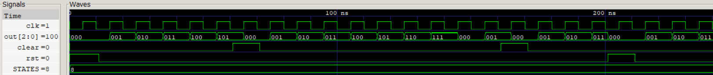

# T-State Counter

A parameterized synchronous T-State Counter used to sequence the execution of instructions in the Control Unit. The counter advances on each positive clock edge and can be reset either through a global asynchronous reset (rst) or synchronously cleared (clear) by the Control Unit when an instruction completes, returning execution to **T0**.

## Features

- Parameterized number of T-states
- Global asynchronous active-high reset
- Synchronous clear input for instruction completion
- Advances on enable to the next T-state every clock cycle

<p align="center">
  
  <br>
  <sub>T-State Counter </sub>
</p>

## Synthesis Results

**Technology:** Sky130 HD  
**Synthesis Tool:** Yosys

| Metric | Value |
|--------|-------:|
| Area | 125.1200 µm² |

## Static Timing Analysis (OpenSTA)

### Scenario 1: Ideal Timing

Clock period constraint:

```
10 ns
```

No input/output timing constraints applied.

| Metric | Value |
|--------|-------:|
| Clock Period | 10 ns |
| Worst Slack | 9.25 ns |
| Estimated Critical Path | 0.75 ns |
| Estimated Fmax | ~1.33 GHz |

### Scenario 2: Constrained Timing

Timing constraints:
```
Input Delay = 1 ns
Output Delay = 1 ns
Clock Period = 10 ns
```
| Metric | Value |
|--------|-------:|
| Clock Period | 10 ns |
| Worst Slack | 8.62 ns |
| Estimated Critical Path | 1.38 ns |
| Estimated Fmax | ~725 MHz |

## Timing Comparison

| Scenario | Worst Slack (ns) | Estimated Fmax |
|----------|-----------------:|---------------:|
| Ideal STA | 9.25 | ~1.33 GHz |
| Constrained STA | 8.62 | ~725 MHz |


## Power Analysis

| Metric | Value |
|--------|-------:|
| Total Power | 15.6 µW |
